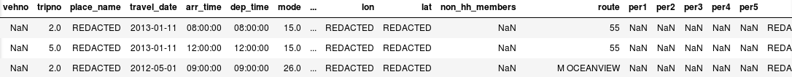
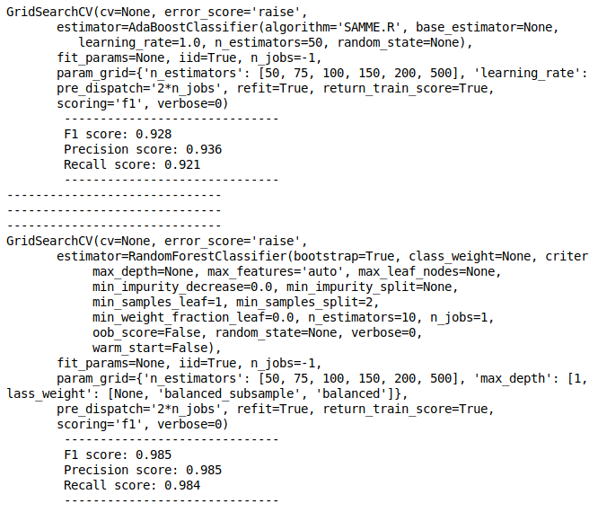

# Predicting Public Transit Utilization

### Can a machine learning model predict whether a given trip will be serviced by public transit?
### If so, which features most strongly contribute to the prediction?

## Data:
The National Renewable Energy Laboratory Transportation Secure Data Center data can be found [here](https://www.nrel.gov/transportation/secure-transportation-data/tsdc-cleansed-data.html)

These datasets consist of travel surveys distributed by several states and collected by NREL. For the preliminary research, I will use the California Household Travel Survey (CHTS) before scaling up to combine surveys from all states.

## EDA:
There are thirty different transportation modes (plus two 'unknown' categories), of which fifteen indicate public transit. These were converted into binary categories with '1' indicating public transit.

In nearly 24% of the records, transportation mode is missing; as these records are not useful for modeling, they were dropped.

### Imbalanced Classes (<4% transit)

Over-/under-sample: SMOTEENN

## Preliminary Results:

## Improved Results:

AdaBoostClassifier(learning_rate=1, n_estimators=500)

Most import features from AdaBoost:

## Future Considerations:

1. Use indicative features (route, etc.) to recover NaNs in mode.
2. Feature engineering: departure time – arrival time = time spent in transit
3. Scale up to national datasets.
4. Incorporate latitude and longitude data.

##### Citation:

https://github.com/scikit-learn-contrib/imbalanced-learn

Transportation Secure Data Center." (2017). National Renewable Energy Laboratory. www.nrel.gov/tsdc.
