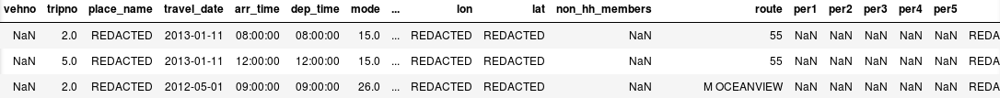
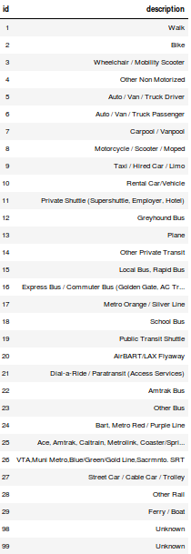
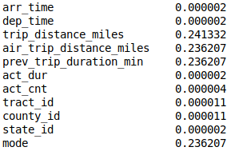
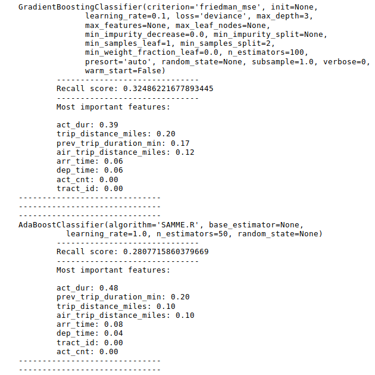
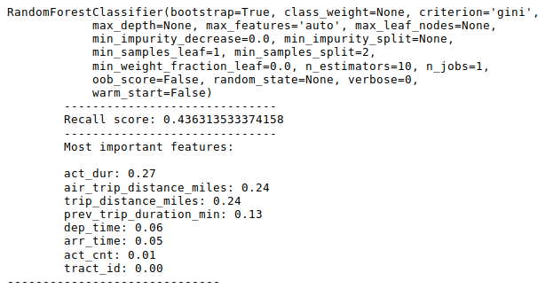
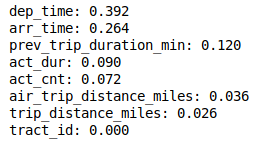

# Predicting Public Transit Utilization

### Can a machine learning model predict whether a given trip will be serviced by public transit?
### If so, which features most strongly contribute to the prediction?

## Data:
The National Renewable Energy Laboratory Transportation Secure Data Center data can be found [here](https://www.nrel.gov/transportation/secure-transportation-data/tsdc-cleansed-data.html)

These datasets consist of travel surveys distributed by several states and collected by NREL. For the preliminary research, I will use the California Household Travel Survey (CHTS) before scaling up to combine surveys from all states.

## EDA:
There are thirty different transportation modes (plus two 'unknown' categories), of which fifteen indicate public transit. These were binarized with '1' indicating public transit and '0' indicating other modes of travel.

In nearly 24% of the records, mode of transportation is missing. Ideally, I would impute the data in this column using indicative features; however, the overlap of missing data between columns makes this impractical. As such, these records are not useful for modeling, and they were dropped.

### Imbalanced Classes (<4% transit)

To correct for a massive class imbalance, which could likely cause issues with the predictive model, I used SMOTEENN: a combination of oversampling (Synthetic Minority Oversampling TEchnique) and undersampling (Edited Nearest Neighbors).

## Preliminary Results:

The results from each model out-of-the-box. Note that as goals shifted throughout the project, the scoring metric shifts from recall to F1 score (which equally balances recall and precision).

## Improved Results:

After grid-searching the models on AWS, F1 score (and thus recall) is vastly improved:

AdaBoostClassifier(learning_rate=1, n_estimators=500)

Most import features from AdaBoost:

## Future Considerations:

1. Scale up to national datasets.
2. Incorporate NREL's secure latitude/longitude data.

##### Citation:

Transportation Secure Data Center." (2017). National Renewable Energy Laboratory. www.nrel.gov/tsdc.
